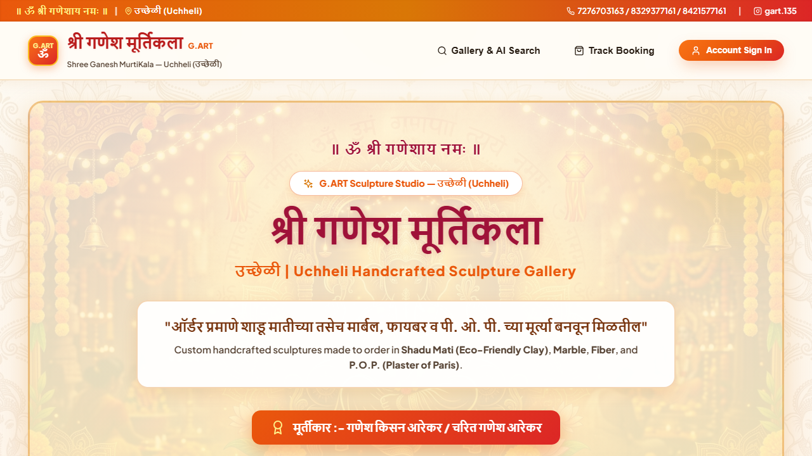
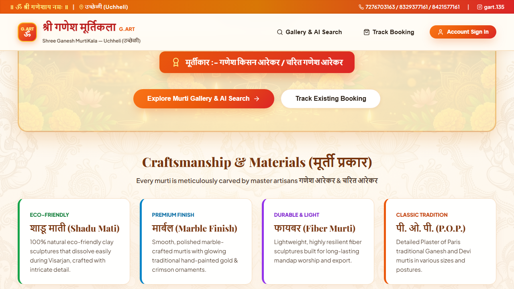

# श्री गणेश मूर्तिकला (Shree Ganesh MurtiKala) — G.ART Uchheli

<div align="center">

```text
               ॥ ॐ श्री गणेशाय नमः ॥
               G.ART SCULPTURE STUDIO
```

### **श्री गणेश मूर्तिकला** — Handcrafted Ganpati & Devi Sculptures
**मूर्तीकार (Master Artisans):** गणेश किसन आरेकर / चरित गणेश आरेकर
**ठिकाण (Location):** उच्छेळी (Uchheli)
**संपर्क (Contact):** 📱 7276703163 / 8329377161 / 8421577161 | 📸 Instagram: `gart.135`

---

</div>

## 📸 Website Preview





---

## 📌 Project Overview

**Shree Ganesh MurtiKala** is a decoupled multi-tier web application built for handcrafted Ganpati and Devi sculpture gallery management, AI-powered natural language search, XML catalog import/export, and dynamic TOTP cybersecurity authentication.

### 🌟 Key Offerings (मूर्ती प्रकार)
- **शाडू माती (Shadu Mati)** — 100% Natural Eco-Friendly Clay Sculptures
- **मार्बल (Marble Finish)** — Smooth Polished Ornate Sculptures
- **फायबर (Fiber)** — Lightweight & Durable Long-Lasting Murtis
- **पी. ओ. पी. (Plaster of Paris)** — Classic Traditional Sculptures

---

## 🏗️ System Architecture

```text
                            MURTIKALA ARCHITECTURE
                                       │
                        ┌──────────────┴──────────────┐
                        │    React.js Frontend UI     │
                        │  (Vite + Bright Saffron UI) │
                        └──────────────┬──────────────┘
                                       │
                             REST API (JSON Payload)
                                       │
                        ┌──────────────┴──────────────┐
                        │     Node.js + Express API   │
                        │   (Port 5000 / SQLite DB)   │
                        └──────┬────────────────┬─────┘
                               │                │
                   ┌───────────┴───────┐   ┌────┴─────────────────────────┐
                   │ SQLite Database   │   │ Python AI & Security Service │
                   │ (murtikala_node.db│   │  (FastAPI - Port 8000)       │
                   │  Murtis, Bookings)│   │  • scikit-learn (TF-IDF)     │
                   └───────────────────┘   │  • NLTK Tokenization         │
                                           │  • PyOTP Dynamic 2FA         │
                                           └──────────────────────────────┘
                                                        │
                                           ┌────────────┴────────────┐
                                           │   XML Import / Export   │
                                           │  (Catalog Management)   │
                                           └─────────────────────────┘
```

---

## 🛠️ Technology Stack

| Component | Technology | Role & Key Dependencies |
| :--- | :--- | :--- |
| **Frontend UI** | **React.js 18 + Vite** | Single-Page Application, Lucide-React icons, Axios, Bright Festive Marigold & Saffron Ganpati design. |
| **Backend REST API** | **Node.js + Express** | Core REST routes, SQLite ORM, Multer file upload storage, `fast-xml-parser` engine. |
| **AI Microservice** | **Python (FastAPI)** | High-performance service running `scikit-learn` TF-IDF Vectorizer + Cosine Similarity & `nltk`. |
| **Cybersecurity** | **PyOTP** | Dynamic 6-digit Time-based One-Time Password (TOTP) generation and validation. |
| **Data Interoperability** | **JSON & XML** | JSON for live web client APIs; XML for enterprise bulk catalog import & export operations. |
| **Database** | **SQLite** | Local relational database (`murtikala_node.db`). |

---

## 🔥 Features & Capabilities

1. **🎨 Vibrant Devotional Saffron & Gold Theme**:
   - Designed with warm ivory cream backgrounds (`#fffcf5`), devotional marigold saffron (`#ea580c`) & kumkum vermillion (`#dc2626`) accents, HD Lord Ganesha artwork backgrounds, Devanagari headers (`॥ ॐ श्री गणेशाय नमः ॥`), and master artisan credits.
2. **🧠 AI Natural Language Search**:
   - Enter natural language queries (e.g. *"5 feet Shadu Mati Ganpati"* or *"seated Devi"*). The Python FastAPI service tokenizes text using NLTK, vectorizes using TF-IDF, and returns similarity match percentage badges in real time.
3. **📑 XML Catalog Import & Export**:
   - **Admin → Export XML**: Download entire murti catalog as a formatted XML file (`murtikala_catalog.xml`).
   - **Admin → Import XML**: Drag-and-drop or paste XML documents to bulk import validated sculpture records into SQLite.
4. **🔐 PyOTP Dynamic Security**:
   - User and admin sign-in secured by 6-digit dynamic TOTP codes generated by the Python PyOTP service.
5. **📦 Booking Reservation & Reference Tracker**:
   - Customers select sculptures, pick event dates, and receive a unique 16-character tracking code (`MK-XXXXXX`).

---

## 📡 REST API Specifications

### Node.js REST API (`http://localhost:5000`)

| Method | Endpoint | Description |
| :--- | :--- | :--- |
| `GET` | `/api/murtis` | Fetch murtis with optional `q` (AI search query), `deity`, `material`, `sort` |
| `GET` | `/api/murtis/:id` | Fetch single murti details with image gallery |
| `POST` | `/api/murtis` | Admin: Create new murti record with Multer image uploads |
| `DELETE` | `/api/murtis/:id` | Admin: Delete murti record |
| `POST` | `/api/bookings` | Create customer booking request (generates `MK-XXXXXX`) |
| `GET` | `/api/bookings/track` | Track booking status by reference code and email |
| `GET` | `/api/catalog/export-xml` | Export entire catalog as XML download |
| `POST` | `/api/catalog/import-xml` | Import murti catalog from uploaded XML file/string |
| `POST` | `/api/auth/register` | Register account and request PyOTP code |
| `POST` | `/api/auth/verify-otp` | Verify PyOTP code and create user session |

### Python AI Microservice (`http://127.0.0.1:8000`)

| Method | Endpoint | Description |
| :--- | :--- | :--- |
| `POST` | `/api/ai/search` | Ranks murti list against search query using NLTK & scikit-learn TF-IDF |
| `POST` | `/api/ai/otp/generate` | Generates dynamic 6-digit TOTP secret & verification code using PyOTP |
| `POST` | `/api/ai/otp/verify` | Validates 6-digit TOTP code against active secret |

---

## ⚙️ Running Locally

### 1. Start Python AI Microservice (Port 8000)
```bash
cd ai-service
python -m pip install -r requirements.txt
python app.py
```

### 2. Start Node.js Backend REST API (Port 5000)
```bash
cd backend
npm install
node server.js
```

### 3. Start React Frontend SPA (Port 5173)
```bash
cd frontend
npm install
npm run dev
```

Open `http://localhost:5173` in your browser.

---

## 📄 XML Catalog Format Example

```xml
<?xml version="1.0" encoding="UTF-8"?>
<murtikala_catalog>
  <exported_at>2026-08-12T20:30:00Z</exported_at>
  <count>1</count>
  <murtis>
    <murti>
      <name>Rajmudra Ganpati (राजमुद्रा गणपती)</name>
      <deity>Ganpati</deity>
      <material>Shadu Mati</material>
      <height_cm>46</height_cm>
      <width_cm>32</width_cm>
      <weight_kg>7.5</weight_kg>
      <availability>Available</availability>
      <description>Graceful handcrafted Rajmudra Ganpati in pure eco-friendly Shadu Mati by master artisans Ganesh Kisan Arekar &amp; Charit Arekar (Uchheli).</description>
    </murti>
  </murtis>
</murtikala_catalog>
```
